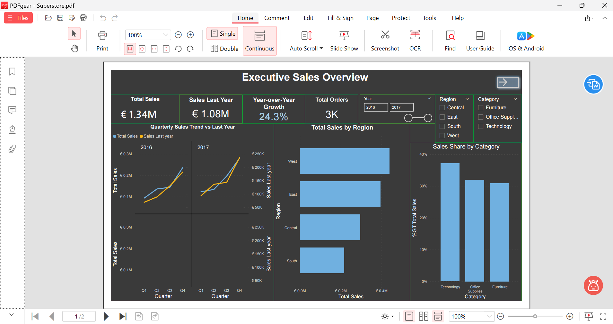
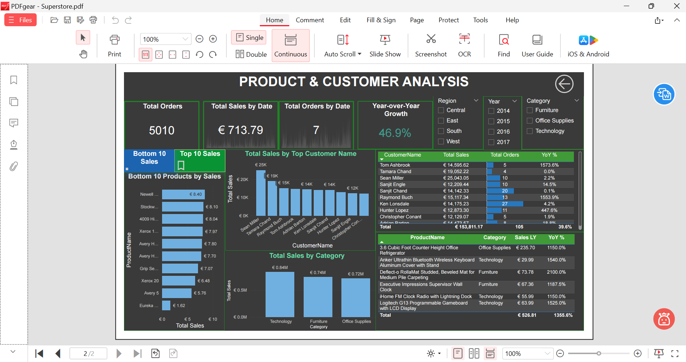

# power-bi-superstore-dashboard
## Project overview

This project analyses Superstore sales data to help business users understand sales performance, year-over-year growth, regional results, category contribution, top customers, and product performance.

The report contains two interactive pages:

- **Executive Sales Overview** - sales KPIs, quarterly sales trend, regional performance, and category sales share.
- 
- **Product & Customer Analysis** - Top/Bottom 10 products, top customers, category analysis, detailed tables, and interactive filters.

## Business questions

- How are sales performing compared with the previous year?
- Which regions generate the most sales?
- Which categories contribute the largest share of total sales?
- Who are the highest-value customers?
- Which products are the best and worst performers?
- How can users switch between Top 10 and Bottom 10 product views?

## Tools and skills used

- Power BI Desktop
- Power Query for data preparation
- DAX measures and time intelligence
- Interactive slicers for Year, Region, and Category
- Bookmarks and buttons for Top/Bottom 10 product switching
- Report page navigation
- KPI cards, line charts, bar charts, tables, and conditional formatting

## Key DAX measures

```DAX
Total Sales = SUM(Orders[Sales])

Total Orders = DISTINCTCOUNT(Orders[Order ID])

Sales LY =
CALCULATE(
    [Total Sales],
    SAMEPERIODLASTYEAR('Date'[Date])
)

YoY Growth % =
DIVIDE(
    [Total Sales] - [Sales LY],
    [Sales LY]
)
Key insights
- Total sales reached €2.30M across approximately 5K orders.
- Sales grew 46.9% compared with the previous year.
- The West region generated the highest sales.
- Technology had the largest share of total sales.
- Product and customer analysis helps identify high-performing and low-performing items for further investigation.
